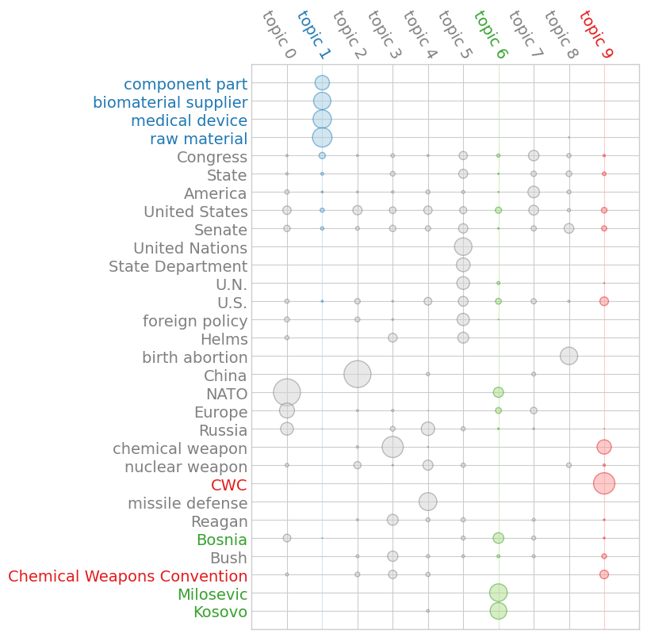

# Terms and Topics in the U.S. Congress

In this tutorial, we will explore the broad topics of discussion among certain members of the U.S. Congress, based on a dataset of thousands of their speeches delivered on the floor.

First, let's initialize and download the dataset, which comes built-in with `textacy`:

```pycon
>>> import textacy.datasets
>>> dataset = textacy.datasets.CapitolWords()
>>> dataset.info
{'name': 'capitol_words',
 'site_url': 'http://sunlightlabs.github.io/Capitol-Words/',
 'description': 'Collection of ~11k speeches in the Congressional Record given by notable U.S. politicians between Jan 1996 and Jun 2016.'}
>>> dataset.download()
```

Each record in this dataset contains the full text of and basic metadata about the speech. Let's take a peek at the first one:

```pycon
>>> next(dataset.records(limit=1))
Record(text='Mr. Speaker, 480,000 Federal employees are working without pay, a form of involuntary servitude; 280,000 Federal employees are not working, and they will be paid. Virtually all of these workers have mortgages to pay, children to feed, and financial obligations to meet.\nMr. Speaker, what is happening to these workers is immoral, is wrong, and must be rectified immediately. Newt Gingrich and the Republican leadership must not continue to hold the House and the American people hostage while they push their disastrous 7-year balanced budget plan. The gentleman from Georgia, Mr. Gingrich, and the Republican leadership must join Senator Dole and the entire Senate and pass a continuing resolution now, now to reopen Government.\nMr. Speaker, that is what the American people want, that is what they need, and that is what this body must do.', meta={'date': '1996-01-04', 'congress': 104, 'speaker_name': 'Bernie Sanders', 'speaker_party': 'I', 'title': 'JOIN THE SENATE AND PASS A CONTINUING RESOLUTION', 'chamber': 'House'})
```

Feel the Bern, circa 1996!

Let's load the first 2000 records into a `textacy.Corpus`. We'll disable the spaCy pipeline's parser for speed (since we won't need dependency annotations), but even still this will take a couple minutes. Hang tight.

```pycon
>>> spacy_lang = textacy.load_spacy_lang("en_core_web_sm", disable=("parser",))
>>> records = dataset.records(limit=2000)
>>> corpus = textacy.Corpus(spacy_lang, data=records)
>>> print(corpus)
Corpus(2000 docs, 1049199 tokens)
```

As we saw in another tutorial, this collection covers speeches given during the late 90s by a handful of politicians, including Bernie Sanders and Joe Biden.

```pycon
>>> corpus.agg_metadata("date", min), corpus.agg_metadata("date", max)
('1996-01-04', '1999-10-08')
```

spaCy's tokenization and annotations provide a flexible base from which we can perform a higher-level splitting of each document into semantically meaningful "terms". For example, let's extract all entities:

```pycon
>>> from textacy import extract
>>> list(extract.entities(corpus[0]))
[Speaker, 480,000, 280,000, Speaker, Newt Gingrich, Republican, House, American, 7-year, Georgia, Gingrich, Republican, Dole, Senate, Speaker, American]
```

Upon inspection, that seems like a mixed bag, so let's clean it up a bit by including only a subset of entity types, and toss in noun- or adjective-only bigrams as well:

```pycon
>>> from functools import partial
>>> terms = list(extract.terms(
...     corpus[0],
...     ngs=partial(extract.ngrams, n=2, include_pos={"NOUN", "ADJ"}),
...     ents=partial(extract.entities, include_types={"PERSON", "ORG", "GPE", "LOC"}),
...     dedupe=True))
>>> terms
[Federal employees, involuntary servitude, Federal employees, financial obligations, Republican leadership, American people, year balanced, balanced budget, budget plan, Republican leadership, American people, Speaker, Speaker, Newt Gingrich, House, Georgia, Gingrich, Dole, Senate, Speaker]
```

Note that "Speaker" (as in _Mr._ Speaker) shows up multiple times: the `dedupe` arg removes exact duplicates based on their positions in the text, but not by their text content.

Before building a document-term matrix representation of the corpus, we must first transform the terms' `Span` objects into strings. There are several options to choose from: use the text content as-is, lowercase it, or if available use lemmas (base forms without inflectional suffixes). To reduce sparsity of the matrix, let's lemmatize the terms:

```pycon
>>> list(extract.terms_to_strings(terms, by="lemma"))
['federal employee', 'involuntary servitude', 'federal employee', 'financial obligation', 'republican leadership', 'american people', 'year balanced', 'balanced budget', 'budget plan', 'republican leadership', 'american people', 'Speaker', 'Speaker', 'Newt Gingrich', 'House', 'Georgia', 'Gingrich', 'Dole', 'Senate', 'Speaker']
```

Looks good! Let's apply these steps to all docs in the corpus:

```pycon
>>> docs_terms = (
...     extract.terms(
...         doc,
...         ngs=partial(extract.ngrams, n=2, include_pos={"NOUN", "ADJ"}),
...         ents=partial(extract.entities, include_types={"PERSON", "ORG", "GPE", "LOC"}))
...     for doc in corpus)
>>> tokenized_docs = (
...     extract.terms_to_strings(doc_terms, by="lemma")
...     for doc_terms in docs_terms)
```

Now we can vectorize the documents. Each row represents a document, each column a unique term, and individual values represent the "weight" of a term in a particular document. These weights may include combinations of local, global, and normalization components; for simplicity, let's use classic TF-IDF weighting, i.e. "Term Frequency" (local) multiplied by "Inverse Doc Frequency" (global).

```pycon
>>> from textacy import representations
>>> doc_term_matrix, vocab = representations.build_doc_term_matrix(tokenized_docs, tf_type="linear", idf_type="smooth")
>>> doc_term_matrix
<2000x30177 sparse matrix of type '<class 'numpy.float64'>'
	    with 58693 stored elements in Compressed Sparse Row format>
```

Let's initialize and fit a topic model to this data. `textacy` provides a common interface to three basic topic models; we'll use an "NMF" model here, and configure it (without any optimization) to use 10 topics.

```pycon
>>> import textacy.tm
>>> model = textacy.tm.TopicModel("nmf", n_topics=10)
>>> model.fit(doc_term_matrix)
```

Using the fit model, we can transform the doc-term matrix into a doc-*topic* matrix, where the columns now correspond to topics and values represent the degree to which a given document is associated with a given topic.

```pycon
>>> doc_topic_matrix = model.transform(doc_term_matrix)
>>> doc_topic_matrix.shape
(2000, 10)
>>> doc_topic_matrix
array([[0.        , 0.        , 0.        , ..., 0.29051627, 0.03107776,
        0.00069874],
       [0.        , 0.        , 0.        , ..., 0.08144687, 0.        ,
        0.        ],
       [0.00210755, 0.        , 0.        , ..., 0.2770269 , 0.        ,
        0.        ],
       ...,
       [0.00559379, 0.00188866, 0.0259026 , ..., 0.01886715, 0.04181629,
        0.00639968],
       [0.        , 0.        , 0.00083651, ..., 0.        , 0.00209634,
        0.        ],
       [0.00407539, 0.00100207, 0.0066426 , ..., 0.05791785, 0.        ,
        0.00239545]])
```

To better understand the topics, we can extract a list of its top terms (those with the highest topic weight), as well as the top documents.

```pycon
>>> id_to_term = {id_: term for term, id_ in vocab.items()}
>>> for topic_idx, terms in model.top_topic_terms(id_to_term, top_n=8):
...     print(f"topic {topic_idx}: {'   '.join(terms)}")
topic 0: NATO   Europe   Russia   Hungary   Poland   Czech Republic   United States   Madrid
topic 1: raw material   medical device   biomaterial supplier   component part   civil action   rating system   product liability   DuPont
topic 2: China   great power   United States   international norm   human right   Pakistan   nuclear weapon   Beijing
topic 3: chemical weapon   Reagan   Bush   Helms   poison gas   Chemical Weapons Convention   Saddam   Iraq
topic 4: missile defense   Russia   national missile   nuclear weapon   arm control   ballistic missile   United States   Soviet Union
topic 5: United Nations   State Department   U.N.   foreign policy   Mexico City   North Carolina   Helms   U.S.
topic 6: Milosevic   Kosovo   Serbia   Bosnia   NATO   KLA   Belgrade   war criminal
topic 7: Speaker   America   Mexico   health care   middle class   Congress   United States   new job
topic 8: birth abortion   Tony   Senate   little baby   partial birth   Donna Joy   Tony Melendez   Lori
topic 9: CWC   chemical weapon   chemical industry   poison gas   U.S.   Chemical Weapons Convention   american chemical   rogue state
>>> for topic_idx, doc_idxs in model.top_topic_docs(doc_topic_matrix, top_n=3):
...     print(f"topic {topic_idx}: {'   '.join(corpus[doc_idx]._.meta['title'] for doc_idx in doc_idxs)}")
topic 0: EXECUTIVE SESSION   THE STRATEGIC RATIONALE FOR NATO ENLARGEMENT   NATO ENLARGEMENT AFTER PARIS
topic 1: STATEMENTS ON INTRODUCED BILLS AND JOINT RESOLUTIONS   STATEMENTS ON INTRODUCED BILLS AND JOINT RESOLUTIONS   DEPARTMENTS OF COMMERCE, JUSTICE, AND STATE, THE JUDICIARY, AND RELATED AGENCIES APPROPRIATIONS ACT, 1999
topic 2: THE CHINA SUMMIT: WHAT KIND OF ENGAGEMENT?   THE SEARCH FOR MODERN CHINA: THE PRESIDENT'S CHINA TRIP   FOREIGN OPERATIONS, EXPORT FINANCING, AND RELATED PROGRAMS APPROPRIATIONS ACT, 1998
topic 3: EXECUTIVE SESSION   FIRST ANNIVERSARY OF THE ENTRY INTO FORCE OF THE CHEMICAL WEAPONS CONVENTION   CHEMICAL WEAPONS CONVENTION
topic 4: NATIONAL MISSILE DEFENSE ACT OF 1999   CRISIS IN RUSSIA   AMERICAN MISSILE PROTECTION ACT OF 1998--MOTION TO PROCEED
topic 5: FOREIGN AFFAIRS REFORM AND RESTRUCTURING ACT OF 1997   FOREIGN AFFAIRS REFORM AND RESTRUCTURING ACT--CONFERENCE REPORT   FOREIGN AFFAIRS REFORM AND RESTRUCTURING ACT OF 1997
topic 6: THE SITUATION IN KOSOVO   RESOLUTION OF THE KOSOVO PROBLEM   PEACE AGREEMENT
topic 7: THE MOST IMPORTANT ISSUES FACING THE AMERICAN PEOPLE   55TH ANNIVERSARY OF THE BATTLE OF CRETE   NARCOTICS CERTIFICATION
topic 8: PARTIAL-BIRTH ABORTION   PARTIAL-BIRTH ABORTION BAN ACT OF 1997   PARTIAL-BIRTH ABORTION BAN ACT of 1997
topic 9: THE URGENT NEED TO OUTLAW POISON GAS   CHEMICAL WEAPONS CONVENTION   EXECUTIVE SESSION
```

At first glance, most of these topics seem relatively interpretable: topic 1 looks to be about medical device manufacturing and liability, topic 6 is focused on the late 90s Kosovo War, topic 9 deals with chemical weapons and related treaties, etc. Seems reasonable!

We can also visualize the relationship between terms and topics using a "termite" plot, where the area of each circle is proportional to a term's weight in a given topic. To aid the eye, we've highlighted those topics called out above:

```pycon
>>> _ = model.termite_plot(doc_term_matrix, id_to_term, n_terms=30, highlight_topics=[1, 6, 9])
```



In this tutorial, we learned how to

- load text+metadata records from a dataset
- add many records to a corpus using a customized spaCy language pipeline
- extract and stringify higher-level "terms" to represent a document
- transform a collection of documents into a doc-term matrix
- fit, inspect, and visualize a topic model
